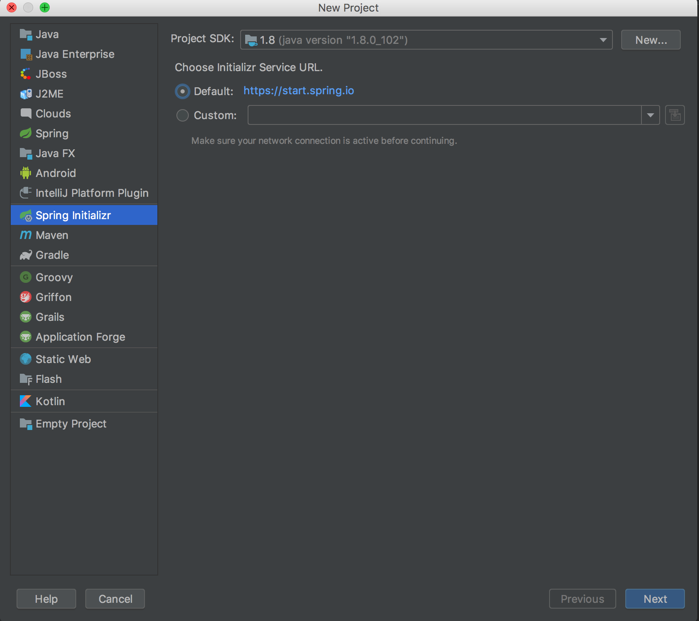
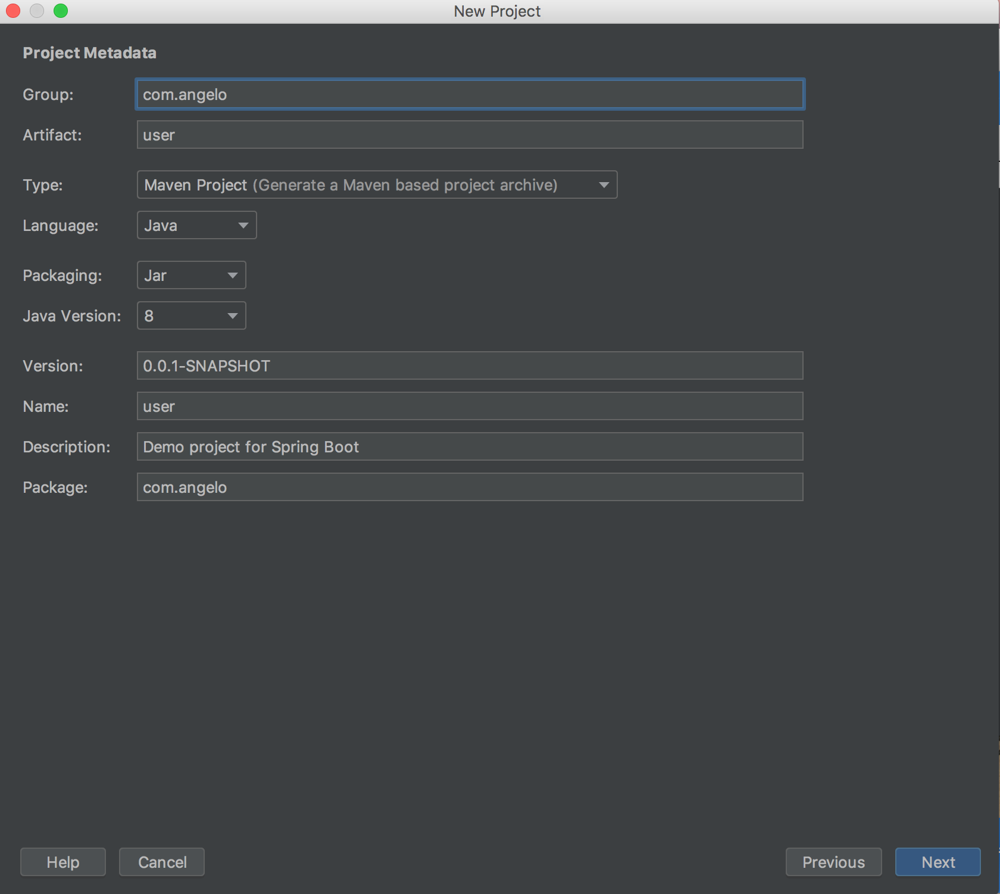
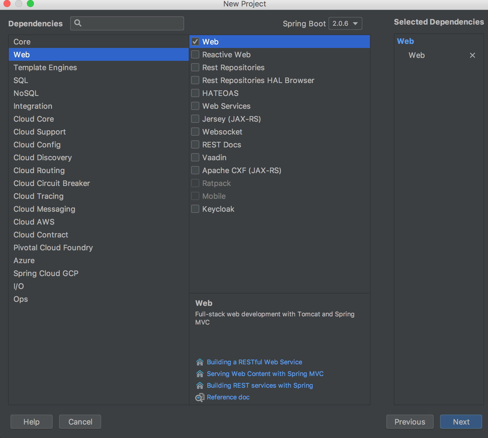
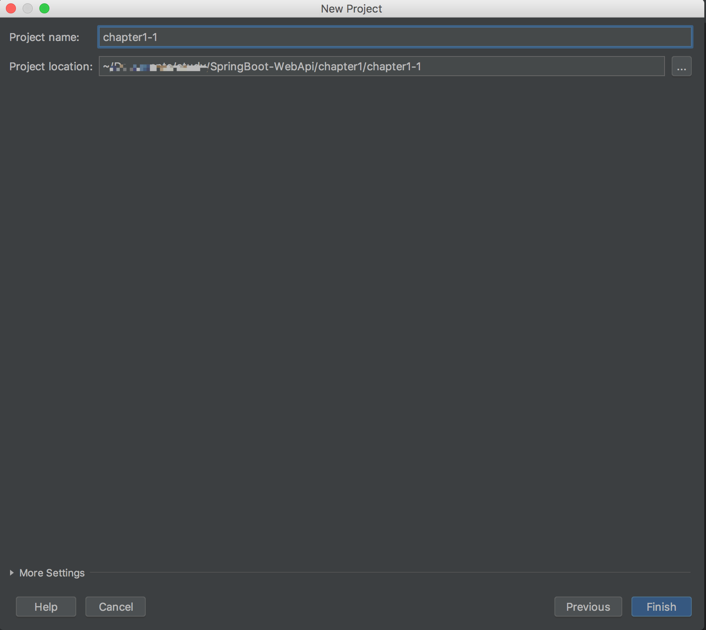
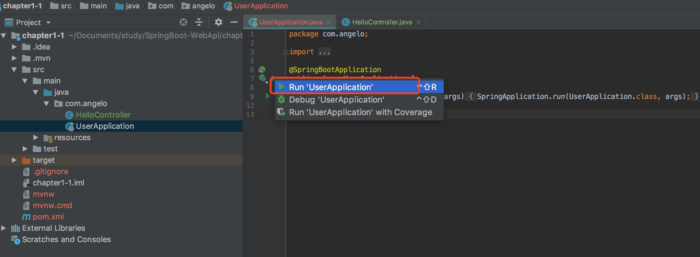
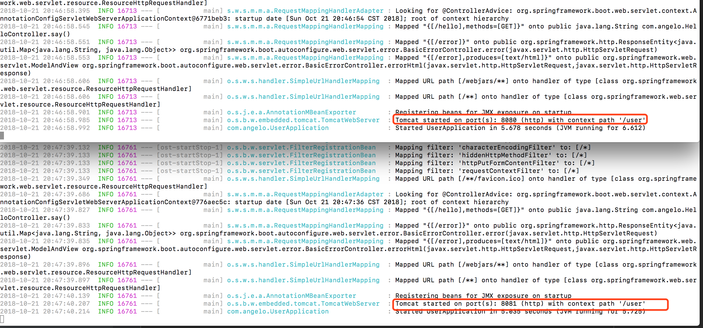
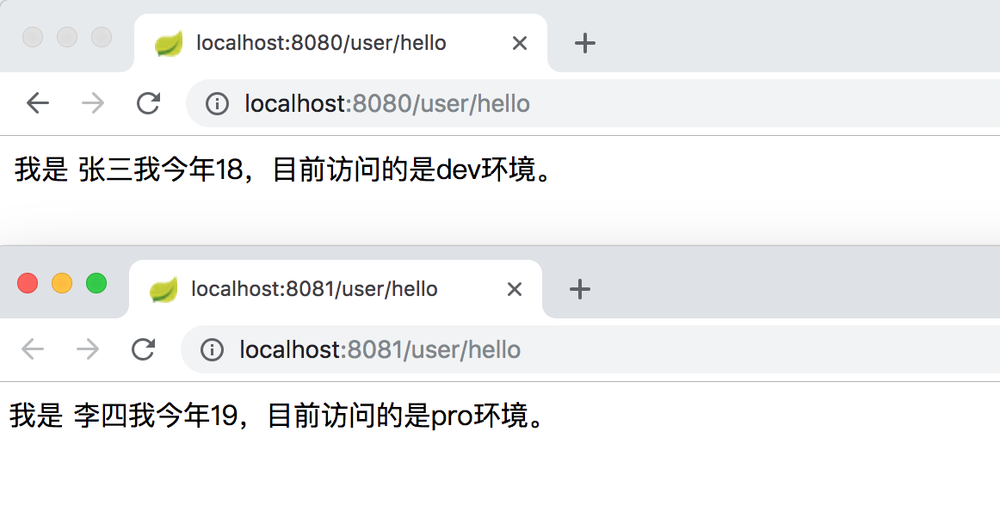

# 项目构建

## 快速导航

* [IntelliJ IDEA 中的Spring Initializr快速构建SpringBoot工程](/chapter1/README.md#intellig编辑器创建)
* [编写一个Hello SpringBoot程序](/chapter1/README.md#编写一个hello-springboot-程序)
     - `[运行程序]` 三种方式启动项目 [`[more]`](/chapter1/README.md#三种启动方式)
* [项目属性配置](/chapter1/README.md#项目属性配置)
    - `[项目属性配置]` application.properties文件设置配置 [`[more]`](/chapter1/README.md#后缀properties文件配置)
    - `[项目属性配置]` application.yml文件设置配置 [`[more]`](/chapter1/README.md#后缀yml文件配置)
    - `[项目属性配置]` 自定义属性配置参数间引用 [`[more]`](/chapter1/README.md#自定义属性配置及参数间引用)
    - `[项目属性配置]` 多环境动态配置 [`[more]`](/chapter1/README.md#多环境动态配置)

## IntelliJ IDEA 中的Spring Initializr快速构建SpringBoot工程
## intellig编辑器创建

* 菜单栏中选择 ```File``` => ```New``` => ```Project```，可以看到下图弹出创建窗口，左侧默认指向Spring Initializr，右侧Choose Initializr Service Url 默认指向 https://start.spring.io/ ，这是Spring官方提供的，在这里也可以创建工程项目。



* 点击```Next```进入下一步，Group: 自己可以根据自己的喜爱命名，自己的名字等都可以；Name：我们这里设置为user；Type：选择Maven；更多参数设置参考以下图片示例



* 点击```Next```进入下一步，可以看到很多Spring的组件供我们选择，这里只选择Web。



* 点击```Next```进入下步，选择项目的存储位置，点击Finish完成整个工程的构建



通过以上步骤完成了项目的创建，下面让我们来看下基本的项目结构：

<pre>
├── src                   业务代码目录
    ├── main  
        ├── java          程序入口
            ...
        ├── resources     资源配置文件
            ...
    ├── test              单元测试目录
        ├── 
├── pom.xml
</pre>

``` pom.xml ``` 
* spring-boot-starter-web: Web项目模块依赖
* spring-boot-starter-test: 测试模块依赖
* spring-boot-maven-plugin: Maven构建项目插件

```xml
...
    <dependencies>
        <dependency>
            <groupId>org.springframework.boot</groupId>
            <artifactId>spring-boot-starter-web</artifactId>
        </dependency>

        <dependency>
            <groupId>org.springframework.boot</groupId>
            <artifactId>spring-boot-starter-test</artifactId>
            <scope>test</scope>
        </dependency>
    </dependencies>

    <build>
        <plugins>
            <plugin>
                <groupId>org.springframework.boot</groupId>
                <artifactId>spring-boot-maven-plugin</artifactId>
            </plugin>
        </plugins>
    </build>
...
```

## 编写一个hello-springboot-程序

创建 ``` HelloControllerl ``` 类，内容如下

```java
package com.angelo;

import org.springframework.web.bind.annotation.RequestMapping;
import org.springframework.web.bind.annotation.RestController;
import org.springframework.web.bind.annotation.RequestMethod;

@RestController
public class HelloController {

    @RequestMapping(value = "/hello", method = RequestMethod.GET)
    public String say() {
        return "Hello SpringBoot!!!";
    }
}
```

#### 三种启动方式

启动有多种方式，让我们分别看下
* 方法一：启动类上，右键单机运行 ``` Run 'UserApplication' ```



* 方法二：进到项目根目录执行命令 ``` mvn spring-boot:run ```
* 方法三：
    * 先执行命令进行编译 ``` mvn install ```
    * 进到target目录可以看到有个 ``` user-0.0.1-SNAPSHOT.jar ```文件
    ```s
    $ cd target   
    $ ls
    classes					maven-archiver				test-classes
    generated-sources			maven-status				user-0.0.1-SNAPSHOT.jar
    generated-test-sources			surefire-reports			user-0.0.1-SNAPSHOT.jar.original
    ```
    * 通过java -jar命令启动 ``` java -jar user-0.0.1-SNAPSHOT.jar ```

打开浏览器访问```http://localhost:8080/hello```，可以看到页面输出```Hello SpringBoot!!!```

[源码地址 https://github.com/Q-Angelo/SpringBoot-Course/tree/master/chapter1/chapter1-1](https://github.com/Q-Angelo/SpringBoot-Course/tree/master/chapter1/chapter1-1)

## 项目属性配置

#### 后缀properties文件配置

SpringBoot默认使用 ```application.properties```文件，位于```/src/main/resources```目录下，项目的默认启动端口是8080，下面对此进行修改

* server.port：修改端口号
* server.context-path：设置url前缀 SpringBoot2.0版本以下采用此方法
* server.servlet.context-path：设置url前缀SpringBoot2.0版本以上使用

application.properties
```s
server.port=8081
server.servlet.context-path=/user
```

#### 后缀yml文件配置

还可以使用```.yml```文件写，优点在于更简洁，推荐此格式

删除```application.properties```文件，新建```application.yml```文件

application.yml
```yml
server:
    port: 8081
    servlet:
        context-path: /user
```

通过以上配置在重启我们的项目，可以看到以下提示，```Tomcat started on port(s): 8081 (http) with context path '/user'```

```s
2018-10-21 16:31:51.003  INFO 14696 --- [           main] o.s.b.w.embedded.tomcat.TomcatWebServer  : Tomcat started on port(s): 8081 (http) with context path '/user'
2018-10-21 16:31:51.008  INFO 14696 --- [           main] com.angelo.UserApplication               : Started UserApplication in 2.999 seconds (JVM running for 4.054)
```

在浏览器运行这次需要加上我们的前缀进行访问 ```http://localhost:8081/user/hello```


#### 自定义属性配置及参数间引用

项目开发中通常还会需要自定义一些配置文件，格式和上面一样，让我们来设置一些访问该网站的用户信息

各参数之间也可相互引用，例如下面info通过${}在括号里引用了user.age

application.yml
```yml
server:
    port: 8081
    servlet:
        context-path: /user
user:
    nickName: 张三
    age: 18
    info: 我今年${user.age}。
```

```/src/main/java/com/angelo```目录下新建```UserProperties.java```文件

UserProperties.java
```java
package com.angelo;

import org.springframework.boot.context.properties.ConfigurationProperties;
import org.springframework.stereotype.Component;

@Component
@ConfigurationProperties(prefix = "user") // 获取前缀是user的配置
public class UserProperties {
    private String nickName;

    private String info;

    public String getNickName() {
        return nickName;
    }

    public void setNickName(String nickName) {
        this.nickName = nickName;
    }

    public String getInfo() {
        return info;
    }

    public void setInfo(String info) {
        this.info = info;
    }
}
```

修改```HelloController.java```

```java
package com.angelo;

import org.springframework.beans.factory.annotation.Autowired;
import org.springframework.web.bind.annotation.RequestMapping;
import org.springframework.web.bind.annotation.RestController;
import org.springframework.web.bind.annotation.RequestMethod;

@RestController
public class HelloController {

    @Autowired
    private UserProperties userProperties;

    @RequestMapping(value = "/hello", method = RequestMethod.GET)
    public String say() {

        return "我是 " + userProperties.getNickName() + userProperties.getInfo();
    }
}

```

启动，浏览器运行```http://localhost:8081/user/hello```


[源码地址 https://github.com/Q-Angelo/SpringBoot-Course/tree/master/chapter1/chapter1-2](https://github.com/Q-Angelo/SpringBoot-Course/tree/master/chapter1/chapter1-2)

#### 多环境动态配置

一个项目在开发中，至少会有两个环境：开发环境、生产环境分别来管理数据链接地址，接口请求地址等，那么对于这种多环境配置我们该怎么操作呢？

SpringBoot中多环境配置需要满足 ``` application-{profile}.yml ```格式，例如我们本次实例中即将要介绍的:

* ```application-dev.yml```：开发环境

```yml
server:
    port: 8080
    servlet:
        context-path: /user
user:
    nickName: 张三
    age: 18
    info: 我今年${user.age}，目前访问的是dev环境。
```

* ```application-pro.yml```：生产环境

```yml
server:
    port: 8081
    servlet:
        context-path: /user
user:
    nickName: 李四
    age: 19
    info: 我今年${user.age}，目前访问的是pro环境。
```

至于哪个文件会被加载，需要对```spring.profiles.active```属性进行设置。
修改```application.yml```文件，会默认加载```application-dev.yml```配置文件

```yml
spring:
    profiles:
        active: dev
```

通过```java -jar```的方式启动

进入项目根目录，执行命令进行编译 ``` mvn install ```

开启了两个终端分别执行命令：

* 开启dev环境 ``` java -jar target/user-0.0.1-SNAPSHOT.jar --spring.profiles.active=dev ```

* 开启pro环境```java -jar target/user-0.0.1-SNAPSHOT.jar --spring.profiles.active=pro```

以下为两个终端的启动信息，可以看到分别开启了8080端口、8081端口



浏览器端同样开启两个窗口分别执行:
* http://localhost:8080/user/hello
* http://localhost:8081/user/hello

分别返回不同环境对应的配置信息，



通过以上实例，可以总结出以下3点：
* application.yml 用来存放公共配置，设置spring.profiles.active=dev，默认开发环境配置
* ``` application-{profile}.yml ```配置不同环境的内容
* 通过命令行 ```java -jar target/user-0.0.1-SNAPSHOT.jar --spring.profiles.active=pro```这种方式激活当前需要运行的环境信息

[源码地址 https://github.com/Q-Angelo/SpringBoot-Course/tree/master/chapter1/chapter1-3](https://github.com/Q-Angelo/SpringBoot-Course/tree/master/chapter1/chapter1-3)