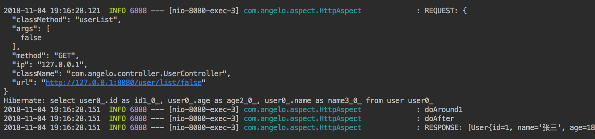
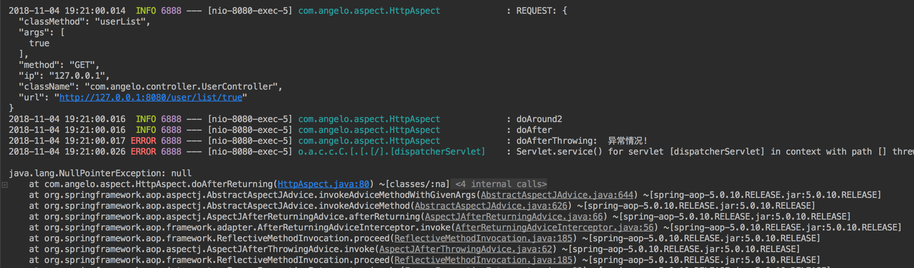

# AOP面向切面编程

> AOP是一种与语言无关的程序思想、[编程范式](#编程范式主要以下几大类)。项目业务逻辑中，将通用的模块以水平切割的方式进行分离统一处理，常用于日志、权限控制、异常处理等业务中。

## 快速导航

* [引入AOP依赖](/chapter3/README.md#引入aop依赖)
* [AOP常用注解解析](/chapter3/README.md#aop注解)
* [实现日志分割功能](/chapter3/README.md#实现日志分割功能)
    * [```@Pointcut``` 添加切入点](/chapter3/README.md#添加切入点)
    * [```@Before``` 前置通知](/chapter3/README.md#前置通知)
    * [```@After``` 后置通知](/chapter3/README.md#后置通知)
    * [```@Around``` 环绕通知](/chapter3/README.md#环绕通知)
    * [```@AfterReturning``` 返回后通知](/chapter3/README.md#返回后通知)
    * [```@AfterThrowing``` 异常通知](/chapter3/README.md#异常通知)
* [一段段伪代码读懂执行顺序](/chapter3/README.md#一段段伪代码读懂执行顺序)
* [对正常、异常两种情况分别进行测试](/chapter3/README.md测试正常异常两种情况)

## 编程范式主要以下几大类

* AOP（Aspect Oriented Programming）面向切面编程
* OOP（Object Oriented Programming）面向对象编程
* POP（procedure oriented programming）面向过程编程
* FP（Functional Programming）面向函数编程

## 引入aop依赖

以下示例是基于[Spring Boot实战系列(2)数据存储之Jpa操作MySQL /chapter2/chapter2-1](https://github.com/Q-Angelo/SpringBoot-Course/tree/master/chapter2/chapter2-1)可在Github获取源码

项目根目录 ```pom.xml``` 添加依赖 ```spring-boot-starter-aop```

```xml
<dependency>
    <groupId>org.springframework.boot</groupId>
    <artifactId>spring-boot-starter-aop</artifactId>
</dependency>
```

## aop注解

* ```@Aspect```: 切面，由通知和切入点共同组成，这个注解标注在类上表示为一个切面。
* ```@Joinpoint```: 连接点，被AOP拦截的类或者方法，在前置通知中有介绍使用```@Joinpoint```获取类名、方法、请求参数。
* ```Advice```: 通知的几种类型
    * ```@Before```: 前置通知，在某切入点```@Pointcut```之前的通知
    * ```@After```: 后置通知，在某切入点```@Pointcut```之后的通知无论成功或者异常。
    * ```@AfterReturning```: 返回后通知，方法执行return之后，可以对返回的数据做加工处理。
    * ```@Around```: 环绕通知，在方法的调用前、后执行。
    * ```@AfterThrowing```: 抛出异常通知，程序出错跑出异常会执行该通知方法。
* ```@Pointcut```: 切入点，从哪里开始。例如从某个包开始或者某个包下的某个类等。

## 实现日志分割功能

目录 ```aspect```下 新建 ```httpAspect.java```类，在收到请求之后先记录请求的相关参数日志信息，请求成功完成之后打印响应信息，请求处理报错打印报错日志信息。

```httpAspect.java```
```java
package com.angelo.aspect;

import com.google.gson.Gson;
import com.google.gson.GsonBuilder;
import org.aspectj.lang.JoinPoint;
import org.aspectj.lang.ProceedingJoinPoint;
import org.aspectj.lang.annotation.*;
import org.slf4j.Logger;
import org.slf4j.LoggerFactory;
import org.springframework.stereotype.Component;
import org.springframework.web.context.request.RequestContextHolder;
import org.springframework.web.context.request.ServletRequestAttributes;

import javax.servlet.http.HttpServletRequest;
import java.util.HashMap;
import java.util.Map;

@Aspect
@Component
public class HttpAspect {
    // 打印日志模块
    private final static Logger logger = LoggerFactory.getLogger(HttpAspect.class);

    // 下面会一一介绍... 
```

#### 添加切入点

定义切入的入口在哪里，封装一个公共的方法实现复用

```httpAspect.java```
```java
    /**
     *  定义一个公共的方法，实现服用
     *  拦截UserController下面的所有方法
     *  拦截UserController下面的userList方法里的任何参数(..表示拦截任何参数)写法：@Before("execution(public * com.angelo.controller.UserController.userList(..))")
     */
    @Pointcut("execution(public * com.angelo.controller.UserController.*(..))")
    public void log() {
    }
```

#### 前置通知

拦截方法之前的一段业务逻辑，获取请求的一些信息，其中用到了```Gson```处理对象转json输出

```httpAspect.java```
```java
@Before("log()")
public void doBefore(JoinPoint joinPoint) {
    ServletRequestAttributes attributes = (ServletRequestAttributes) RequestContextHolder.getRequestAttributes();
    HttpServletRequest request = attributes.getRequest();

    Map params = new HashMap();
    params.put("url", request.getRequestURL()); // 获取请求的url
    params.put("method", request.getMethod()); // 获取请求的方式
    params.put("ip", request.getRemoteAddr()); // 获取请求的ip地址
    params.put("className", joinPoint.getSignature().getDeclaringTypeName()); // 获取类名
    params.put("classMethod", joinPoint.getSignature().getName()); // 获取类方法
    params.put("args", joinPoint.getArgs()); // 请求参数

    // 输出格式化后的json字符串
    Gson gson = new GsonBuilder().setPrettyPrinting().create();

    logger.info("REQUEST: {}", gson.toJson(params));
}
```

#### 后置通知

拦截方法之后的一段业务逻辑

```httpAspect.java```
```java
@After("log()")
public void doAfter() {
    logger.info("doAfter");
}
```

#### 环绕通知

环绕通知是在方法的前后的一段逻辑操作，可以修改目标方法的返回值，第一个参数是```org.aspectj.lang.ProceedingJoinPoint```类型，注意这里要调用执行目标方法```proceed()```获取值返回，不然会造成空指针异常。在环绕通知里面也可以捕获错误返回。

```httpAspect.java```
```java
@Around("log()")
public Object doAround(ProceedingJoinPoint point) {
    try {
        Object o =  point.proceed();
        System.out.println("方法环绕proceed，结果是 :" + o);
        logger.info("doAround1");

        return o;
    } catch (Throwable e) {
        // e.printStackTrace();
        logger.info("doAround2");

        return null;
    }
}
```

#### 返回后通知

在切入点完成之后的返回通知，此时就不会抛出异常通知，除非返回后通知的业务逻辑报错。

```httpAspect.java```
```java
    /**
     * 获取响应返回值
     * @param object
     */
    @AfterReturning(returning = "object", pointcut = "log()")
    public void doAfterReturning(Object object) {
        // logger.info("RESPONSE: {}", object); 会打印出一个对象，想打印出具体内容需要在定义模型处加上toString()

        logger.info("RESPONSE: {}", object.toString());
    }
```

#### 异常通知

抛出异常后的通知，此时返回后通知```@AfterReturning```就不会执行。

```httpAspect.java```
```java
@AfterThrowing(pointcut = "log()")
public void doAfterThrowing() {
    logger.error("doAfterThrowing: {}", " 异常情况!");
}
```

#### 一段段伪代码读懂执行顺序

```java
try {
    // @Before 执行前通知

    // 执行目标方法

    // @Around 执行环绕通知 成功走finall，失败走catch
} finally {
    // @After 执行后置通知

    // @AfterReturning 执行返回后通知
} catch(e) {
    // @AfterThrowing 抛出异常通知
}
```

#### 测试正常异常两种情况

测试之前先对```controller/UserController.java```文件的```userList```方法增加了```exception```参数

```java
    /**
     * 查询用户列表
     * @return
     */
    @RequestMapping(value = "/user/list/{exception}")
    public List<User> userList(@PathVariable("exception") Boolean exception) {
        if (exception) {
            throw new Error("测试抛出异常!");
        }

        return userRepository.findAll();
    }
```

* 测试正常情况

``` curl 127.0.0.1:8080/user/list/false ```

正常情况返回值如下所示:



* 测试异常情况

``` curl 127.0.0.1:8080/user/list/true ```

异常情况返回值如下所示:



通过以上两种情况测试可以看到环绕通知在正常、异常两种情况都可以执行到。

[Github查看本文完整示例 chapter3-1](https://github.com/Q-Angelo/SpringBoot-Course/tree/master/chapter3/chapter3-1)