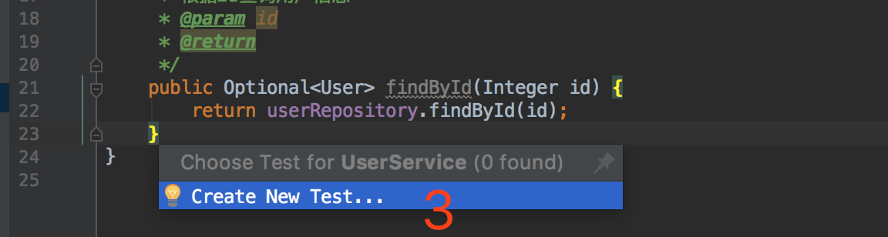
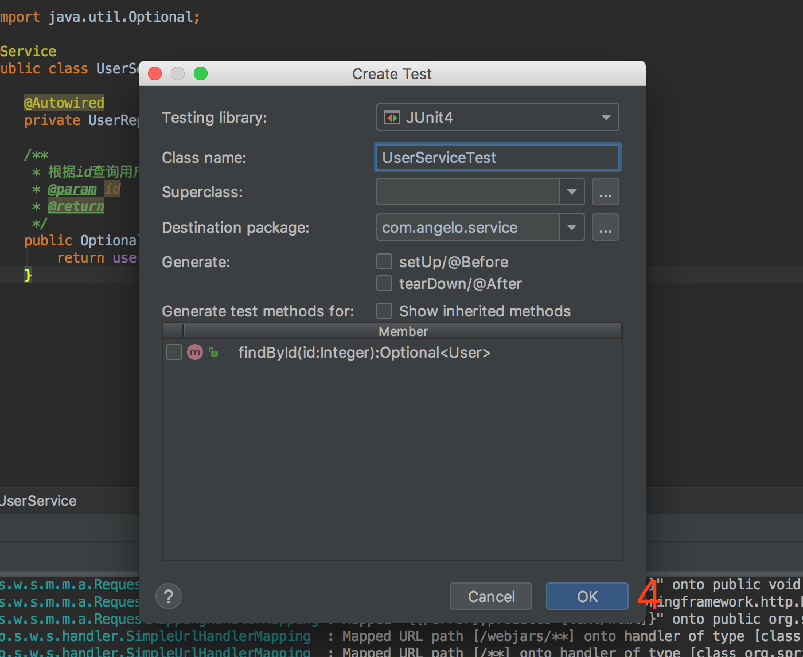
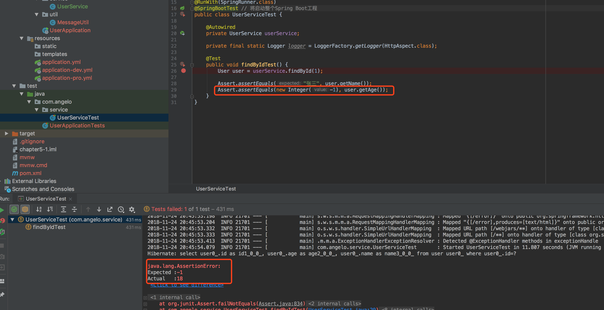
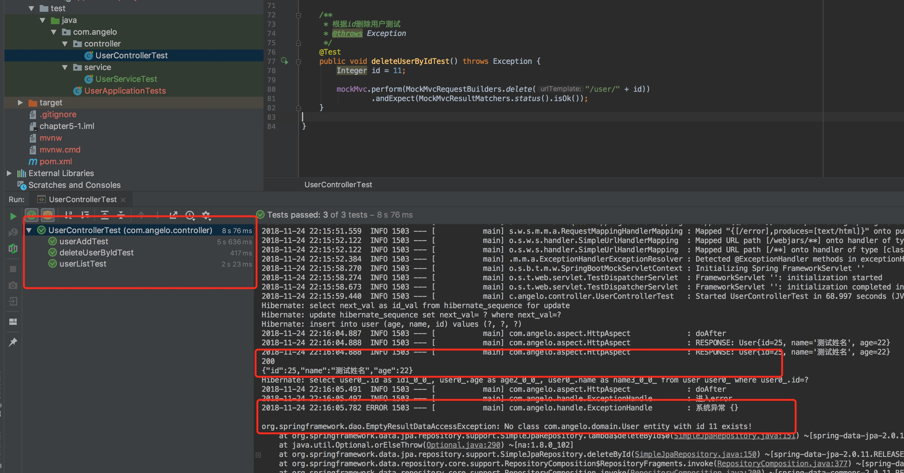

# 单元测试

> 本篇主要介绍了Spring Boot中创建单元测试，分别讲解了Service层单元测试、Controller层基于MockMvc的单元测试。

## 快速导航

* [添加Maven依赖](/chapter5/README.md#添加maven依赖)
* [借助IntelliJ IDEA编辑器快速创建测试类](/chapter5/README.md#创建测试类)
* [Service单元测试](/chapter5/README.md#service单元测试)
* [Controller单元测试](/chapter5/README.md#controller单元测试)
* [问题汇总](/chapter5/README.md#问题汇总)
    

## 添加maven依赖

```xml
<dependency>
    <groupId>org.springframework.boot</groupId>
    <artifactId>spring-boot-starter-test</artifactId>
    <scope>test</scope>
</dependency>
```

## 创建测试类

Spring Boot单元测试是在```/src/test/java```目录下，可以选择手动创建测试类，另外还可以借助IDE快速创建，在需要创建测试的文件上点击头部菜单栏选择```/Navigate/Test```或者快捷键```⇧⌘T（Mac电脑）```来创建，如下所示：


单击```Test```之后会出现一个小弹窗提示 ``` Create New Test... ```，如下所示：



点击 ``` Create New Test... ```，弹出如下窗口所示



点击ok创建测试类 ```UserSerciveTest.java```

```java
package com.angelo.service;

import static org.junit.Assert.*;

public class UserServiceTest {

}
```

## service单元测试

创建``` service/UserServiceTest.java ``` 类，在类名上加上以下两个注解，就可以让一个普通类变成一个单元测试类。

1. ```@RunWith(SpringRunner.class)```：```@RunWith```是一个运行器，```SpringRunner.class```表示使用```Spring Test```进行单元测试，其中```SpringRunner```继承类```SpringJUnit4ClassRunner```。
2. ```@SpringBootTest```：将启动整个Spring Boot工程

``` service/UserServiceTest.java ```
```java
package com.angelo.service;

import com.angelo.aspect.HttpAspect;
import com.angelo.domain.User;
import org.junit.Assert;
import org.junit.Test;
import org.junit.runner.RunWith;
import org.slf4j.Logger;
import org.slf4j.LoggerFactory;
import org.springframework.beans.factory.annotation.Autowired;
import org.springframework.boot.test.context.SpringBootTest;
import org.springframework.test.context.junit4.SpringRunner;


@RunWith(SpringRunner.class)
@SpringBootTest
public class UserServiceTest {

    @Autowired
    private UserService userService;

    private final static Logger logger = LoggerFactory.getLogger(HttpAspect.class);

    @Test
    public void findByIdTest() {
        User user = userService.findById(1);

        // 断言，是否和预期一致
        Assert.assertEquals("张三", user.getName());
        Assert.assertEquals(new Integer(-1), user.getAge());
    }
}
```
在测试类上右击选择```Run 'UserServiceTest'```，可以看到以下运行结果我们期望的```user.getAge()```为18，但是实际返回的是-1



## controller单元测试

以上是针对业务层测试，如果想进行接口API测试怎么办呢，难道，开发完成每次调用postman一个个测吗？答案当然是```no```，不过，你也可以选择一个个测试没什么问题，如果你想通过代码实现模拟http请求就要用到我们的```@AutoConfigureMockMvc```注解，使用了MockMvc无需启动项目，就可实现接口测试。

以下用到的MockMvc方法介绍

* ```mockMvc.perform```：执行请求
* ```MockMvcRequestBuilders.get```：还支持post、put、delete等
* ```contentType(MediaType.APPLICATION_JSON_UTF8)```：表示请求传输的```Conent-Type=application/json;charset=utf-8```
* accept(MediaType.APPLICATION_JSON))：客户端希望接收的```Conent-Type=application/json;```
* ```andExpect(MockMvcResultMatchers.status().isOk())```：返回响应状态是否为期望的200，如果不是则抛出异常
* ```andReturn()```：返回结果

```controller/UserControllerTest.java```

```java
package com.angelo.controller;

import com.angelo.domain.User;
import com.google.gson.Gson;
import com.google.gson.GsonBuilder;
import org.junit.Test;
import org.junit.runner.RunWith;
import org.springframework.beans.factory.annotation.Autowired;
import org.springframework.boot.test.autoconfigure.web.servlet.AutoConfigureMockMvc;
import org.springframework.boot.test.context.SpringBootTest;
import org.springframework.http.MediaType;
import org.springframework.mock.web.MockHttpServletRequest;
import org.springframework.mock.web.MockHttpServletResponse;
import org.springframework.test.context.junit4.SpringRunner;
import org.springframework.test.web.servlet.MockMvc;
import org.springframework.test.web.servlet.MvcResult;
import org.springframework.test.web.servlet.request.MockMvcRequestBuilders;
import org.springframework.test.web.servlet.result.MockMvcResultMatchers;

import static org.junit.Assert.*;

@RunWith(SpringRunner.class)
@SpringBootTest
@AutoConfigureMockMvc
public class UserControllerTest {

    @Autowired
    private MockMvc mockMvc;

    /**
     * 查询用户列表
     * @throws Exception
     */
    @Test
    public void userListTest() throws Exception {

        String url = "/user/list/false";

        MvcResult mvcResult = mockMvc.perform(MockMvcRequestBuilders.get(url))
                .andExpect(MockMvcResultMatchers.status().isOk())
                .andReturn();

        MockHttpServletResponse response = mvcResult.getResponse();

        System.out.println(response.getStatus()); // 获取响应状态码
        System.out.println(response.getContentAsString()); // 获取响应内容
    }

    /**
     * 创建测试用户
     * @throws Exception
     */
    @Test
    public void userAddTest() throws Exception {
        User user = new User();
        user.setName("测试姓名");
        user.setAge(22);
        Gson gson = new GsonBuilder().setPrettyPrinting().create();

        MvcResult mvcResult = mockMvc.perform(MockMvcRequestBuilders.post("/user")
                .contentType(MediaType.APPLICATION_JSON_UTF8)
                .content(gson.toJson(user))
                .accept(MediaType.APPLICATION_JSON))
                .andReturn();

        MockHttpServletResponse response = mvcResult.getResponse();

        System.out.println(response.getStatus()); // 获取响应状态码
        System.out.println(response.getContentAsString()); // 获取响应内容
    }

    /**
     * 根据id删除用户测试
     * @throws Exception
     */
    public void deleteUserByIdTest() throws Exception {
        Integer id = 11;

        mockMvc.perform(MockMvcRequestBuilders.delete("/user/" + id))
                .andExpect(MockMvcResultMatchers.status().isOk());
    }

}
```

运行结果如下，可以看到左边为本次测试涉及到的测试方法及时间，右边控制台分别打印了创建用户日志、及删除用户日志信息。其中，删除用户因为id=11不存在，因此抛出了一个异常。



## 问题汇总

```org.hibernate.LazyInitializationException: could not initialize proxy [com.angelo.domain.User#1] - no Session```

原因是懒加载的问题，因为hibernate的机制是当我们查询一个对象的时候，在默认情况下，返回的只是该对象的普通属性，当用户去使用对象属性的时候，才会向数据库再一次查询，可是，这时session已经关闭了，无法对数据库进行查询。

```解决方案：``` SpringBoot配置文件设置```spring.jpa.properties.hibernate.enable_lazy_load_no_trans=true```

``` application.yml ```

```yml
spring:
    jpa:
        hibernate:
            ddl-auto: update
        show-sql: true
        database: mysql
        properties:
            hibernate:
                enable_lazy_load_no_trans: true
```

[Github查看本文完整示例 chapter5-1](https://github.com/Q-Angelo/SpringBoot-Course/tree/master/chapter4/chapter4-1)