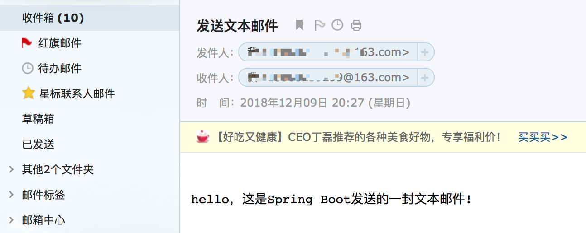
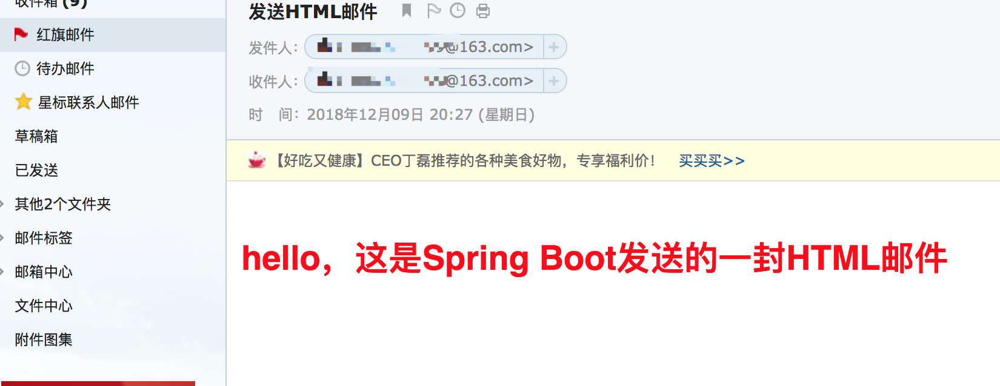
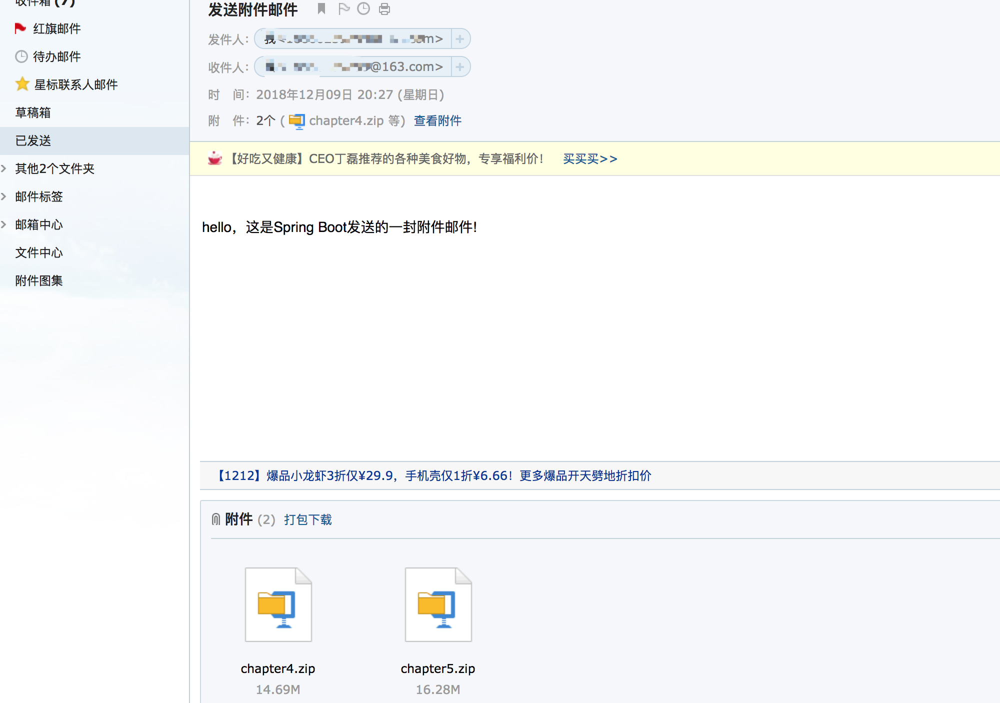
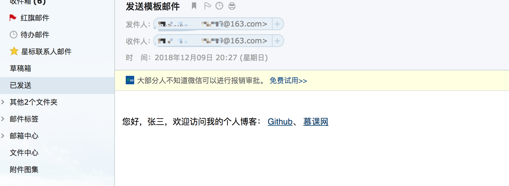

# 邮件发送

> 本篇主要介绍了Spring Boot中邮件发送，分别讲解了简单的文本邮件、HTML邮件、附件邮件、图片邮件、模板邮件。

## 快速导航

* [添加Maven依赖](/chapter6/README.md#添加maven依赖)
* [配置文件增加邮箱相关配置](/chapter6/README.md#配置文件增加邮箱相关配置)
* [Service、Test项目代码构建](/chapter6/README.md#项目构建)
* [五种邮件发送类型讲解](/chapter6/README.md#五种邮件发送类型讲解)
    * [文本邮件](/chapter6/README.md#文本邮件)
    * [html邮件](/chapter6/README.md#html邮件)
    * [附件邮件](/chapter6/README.md#附件邮件)
    * [html内嵌图片邮件](/chapter6/README.md#html内嵌图片邮件)
    * [模板邮件](/chapter6/README.md#html内嵌图片邮件)
* [问题汇总](/chapter6/README.md#问题汇总)
    

## 添加maven依赖

在```Spring Boot```项目的```pom.xml```文件中引入```spring-boot-starter-email```依赖

```xml
<dependency>
    <groupId>org.springframework.boot</groupId>
    <artifactId>spring-boot-starter-email</artifactId>
    <scope>email</scope>
</dependency>
```

模版邮件需要引入 ```spring-boot-starter-thymeleaf``` 插件

```xml
<dependency>
    <groupId>org.springframework.boot</groupId>
    <artifactId>spring-boot-starter-thymeleaf</artifactId>
</dependency>
```

## 配置文件增加邮箱相关配置

163邮箱配置，注意要替换自己的账户信息，password为授权码。

```application.yml```
```yml
spring: 
    mail:
        host: smtp.163.com
        username: your163account@163.com
        password: your163password
        default-encoding: utf-8
```

QQ邮箱发送邮件配置，以下password为授权码

```yml
spring:
    mail:
        host: smtp.qq.com
        username: yourqqaccount@qq.com
        password: yourQQpassword
```

## 项目构建

基于上节单元测试[chapter5-1](https://github.com/Q-Angelo/SpringBoot-Course/tree/master/chapter5/chapter5-1)代码示例基础之上编写
#### 业务层代码

service目录下创建MailService.java文件，负责业务层邮件发送功能编写

让我们利用Spring提供的```JavaMailSender```接口实现邮件发送，在项目中使用到地方用```@Autowired```注入邮件发送对象

```MailService.java```
```java
package com.angelo.service;

import org.springframework.beans.factory.annotation.Autowired;
import org.springframework.beans.factory.annotation.Value;
import org.springframework.core.io.FileSystemResource;
import org.springframework.mail.SimpleMailMessage;
import org.springframework.mail.javamail.JavaMailSender;
import org.springframework.mail.javamail.MimeMessageHelper;
import org.springframework.stereotype.Service;

import javax.mail.MessagingException;
import javax.mail.internet.MimeMessage;
import java.io.File;

@Service
public class MailService {

    @Value("${spring.mail.username}")
    private String from;

    @Autowired // 项目启动时将mailSender注入
    private JavaMailSender javaMailSender;

    // ... 下面会一一介绍 ...
}
```

#### 单元测试层代码

test测试目录下创建```MailServiceTest.java```测试类，对业务层代码进行单元测试

```MailServiceTest.java```
```java
package com.angelo.service;

import org.junit.Test;
import org.junit.runner.RunWith;
import org.springframework.beans.factory.annotation.Autowired;
import org.springframework.boot.test.context.SpringBootTest;
import org.springframework.test.context.junit4.SpringRunner;
import org.thymeleaf.TemplateEngine;
import org.thymeleaf.context.Context;

import javax.annotation.Resource;
import javax.mail.MessagingException;

import java.lang.reflect.Array;

import static org.junit.Assert.*;

@RunWith(SpringRunner.class)
@SpringBootTest
public class MailServiceTest {

    @Autowired
    private MailService mailService;

    @Resource
    TemplateEngine templateEngine;

    String to = "your163password@163.com";

    // ... 下面为一一介绍 ...
}
```

## 五种邮件发送类型讲解

#### 文本邮件

```SimpleMailMessage```封装了简单邮件的发送、接收功能、监测异常模块功能，这也是最简单的一种邮件发送，创建一个邮件消息对象，设置邮件的发送者、发送对象、邮件主题、邮件内容。

* 业务层```MailService.java```
```java
/**
 * 发送文本邮件
 * @param to
 * @param subject
 * @param content
 */
public void sendTextMail(String to, String subject, String content) {
    SimpleMailMessage message = new SimpleMailMessage();
    message.setTo(to); // 发送对象
    message.setSubject(subject); // 邮件主题
    message.setText(content); // 邮件内容
    message.setFrom(from); // 邮件的发起者

    javaMailSender.send(message);
}
```

对以上业务代码进行单元测试，查看下效果

* 单元测试层```MailServiceTest.java```
```java
@Test
public void sendTextEmailTest() {
    mailService.sendTextMail(to, "发送文本邮件", "hello，这是Spring Boot发送的一封文本邮件!");
}
```

* 测试结果



#### html邮件

基于```MimeMessageHelper```创建```helper```对象，设置setText第二个参数为true，将会使用html格式打印邮件。

* 业务层```MailService.java```
```java
/**
 * 发送HTMl邮件
 * @param to
 * @param subject
 * @param content
 * @throws MessagingException
 */
public void sendHtmlMail(String to, String subject, String content) throws MessagingException {
    MimeMessage message = javaMailSender.createMimeMessage();
    MimeMessageHelper helper = new MimeMessageHelper(message, true);
    helper.setFrom(from);
    helper.setTo(to);
    helper.setSubject(subject);
    helper.setText(content, true);

    javaMailSender.send(message);
}
```

* 单元测试层```MailServiceTest.java```
```java
@Test
public void sendHtmlEmailTest() throws MessagingException {
    String content = "<html>" +
            "<body>" +
                "<h1 style=\"" + "color:red;" + "\">hello，这是Spring Boot发送的一封HTML邮件</h1>" +
            "</body></html>";

    mailService.sendHtmlMail(to, "发送HTML邮件", content);
}
```

* 测试结果

可以看到邮件结果使用了例子中预先设置好的邮件格式



#### 附件邮件

* 业务层```MailService.java```
```java
    /**
     * 发送带附件的邮件
     * @param to
     * @param subject
     * @param content
     * @param filePathList
     * @throws MessagingException
     */
    public void sendAttachmentMail(String to, String subject, String content, String[] filePathList) throws MessagingException {
        MimeMessage message = javaMailSender.createMimeMessage();
        MimeMessageHelper helper = new MimeMessageHelper(message, true);

        helper.setFrom(from);
        helper.setTo(to);
        helper.setSubject(subject);
        helper.setText(content, true);

        for (String filePath: filePathList) {
            System.out.println(filePath);

            FileSystemResource fileSystemResource = new FileSystemResource(new File(filePath));
            String fileName = fileSystemResource.getFilename();
            helper.addAttachment(fileName, fileSystemResource);
        }

        javaMailSender.send(message);
    }
```

```filePathList```写上你的附件文件路径，数组格式。

* 单元测试层```MailServiceTest.java```
```java
    @Test
    public void sendAttachmentEmailTest() throws MessagingException {
        String[] filePathList = new String[2];
        filePathList[0] = "/SpringBoot-WebApi/chapter4.zip";
        filePathList[1] = "/SpringBoot-WebApi/chapter5.zip";

        mailService.sendAttachmentMail(to, "发送附件邮件", "hello，这是Spring Boot发送的一封附件邮件!", filePathList);
    }
```

* 测试结果



#### html内嵌图片邮件

也是基于html邮件发送，通过内嵌图片等静态资源，可以直接看到图片。

* 业务层```MailService.java```
```java
    /**
     * 发送html内嵌图片的邮件
     * @param to
     * @param subject
     * @param content
     * @param srcPath
     * @param srcId
     * @throws MessagingException
     */
    public void sendHtmlInlinePhotoMail(String to, String subject, String content, String srcPath, String srcId) throws MessagingException {
        MimeMessage message = javaMailSender.createMimeMessage();
        MimeMessageHelper helper = new MimeMessageHelper(message, true);

        helper.setFrom(from);
        helper.setTo(to);
        helper.setSubject(subject);
        helper.setText(content, true);

        FileSystemResource fileSystemResource = new FileSystemResource(new File(srcPath));
        helper.addInline(srcId, fileSystemResource);

        javaMailSender.send(message);
    }
```

以下单元测试中srcPath为您的本地图片路径，srcId要和上面业务层的```helper.addInline(srcId, fileSystemResource)```srcId保持一致。

* 单元测试层```MailServiceTest.java```
```java
    @Test
    public void sendHtmlInlinePhotoMailTest() throws MessagingException {
        String srcPath = "/SpringBoot-WebApi/chapter6/img/pic18.jpg";
        String srcId = "pic18";
        String content = "<html>" +
                "<body>" +
                "<h2>hello，这是Spring Boot发送的一封HTML内嵌图片的邮件</h2>" +
                "</img>" +
                "</body></html>";

        mailService.sendHtmlInlinePhotoMail(to, "发送图片邮件", content, srcPath, srcId);
    }
```

* 测试结果


#### 模板邮件

> 邮件内容相对简单的情况下，我们可以选择使用以上几种简单邮件发送方法，在复杂业务中需要用到html结构，且html里的数据还需要动态修改，还是选择模版邮件，可以使用```Freemarker```、```thymeleaf```等模板引擎，这里主要介绍使用```thymeleaf```。

* 邮件模板编写

```resources/templates```目录下新建```emailTemplate.html```文件

```html
<!DOCTYPE html>
<html lang="en" xmlns:th="http://www.thymeleaf.org">
<head>
    <meta charset="UTF-8">
    <title>模板邮件</title>
</head>
<body>
您好，<span th:text="${username}"></span>，欢迎访问我的个人博客：
    <a href="https://github.com/Q-Angelo/summarize">Github</a>、
    <a th:href="@{https://www.imooc.com/u/{id}(id=${id})}" href="#">慕课网</a>
</body>
</html>
```

利用上面介绍的发送html邮件即可，在单元测试文件中增加一个方法进行测试。

* 单元测试层```MailServiceTest.java```
```java
@Test
public void testTemplateEmailTest() throws MessagingException {
    Context context = new Context();
    context.setVariable("username", "张三");
    context.setVariable("id", "2667395");

    String emailContent = templateEngine.process("emailTemplate", context);

    mailService.sendHtmlMail(to, "发送模板邮件", emailContent);
}
```

* 测试结果



## 常见问题

出现这个错误的原因是网易将我发送的邮件当成了垃圾邮件，<<发送163文本邮件>>这是我填写的邮件标题，后来发现网易是对标题里面含了```163```导致的，大家遇到类似问题多检查下。

```
com.sun.mail.smtp.SMTPSendFailedException: 554 DT:SPM 163 smtp10,DsCowADH1MxWegtcyxFjDw--.48939S2 1544256086
```

如遇到其他什么可在[issues](https://github.com/Q-Angelo/SpringBoot-Course/issues)中提问

[Github查看本文完整示例 chapter6-1](https://github.com/Q-Angelo/SpringBoot-Course/tree/master/chapter6/chapter6-1)