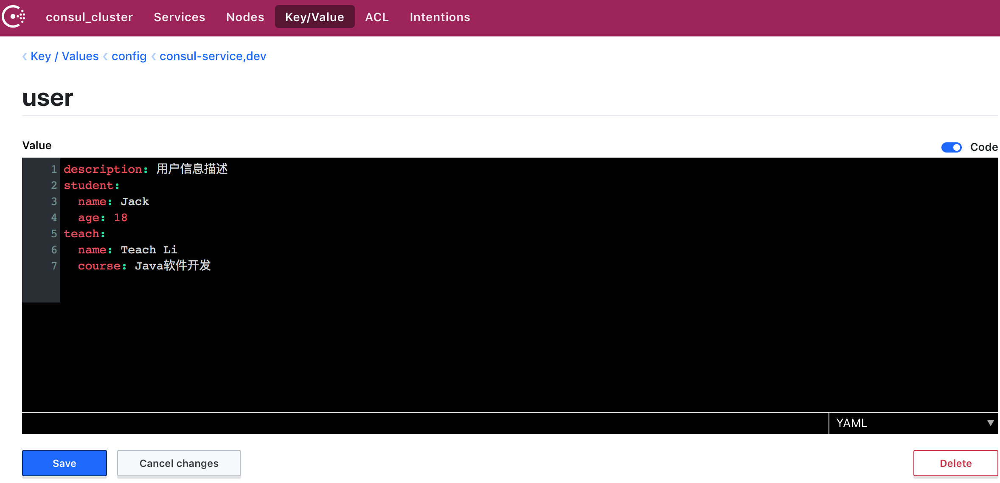
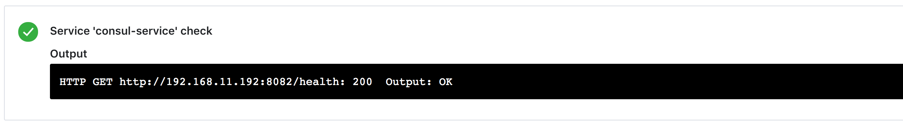

# Spring Boot 集成服务注册发现之Consul配置中心

> 本篇主要介绍了 `Spring Boot` 如何与 `Consul` 进行集成，Consul 只是服务注册的一种实现，还有其它的例如 Zookeeper、Etcd 等，服务注册发现在微服务架构中扮演这一个重要的角色，伴随着服务的大量出现，服务与服务之间的配置管理、运维管理也变的难以维护，通过 Consul 可以解决这些问题，实现服务治理、服务监控。


关于 Consul 的更多知识点不在这里赘述，但是在学习本节之前还是希望您能先了解下，请移步我之前写的 [微服务服务注册发现之 Consul 系列](https://github.com/Q-Angelo/Nodejs-Roadmap/blob/master/docs/microservice/consul.md)

## 快速导航

* [添加 Consul Maven依赖](/chapter7/README.md#添加maven依赖)
* [系统级配置文件&应用级配置文件](/chapter7/README.md#配置文件)
* [配置Consul管理控制台](/chapter7/README.md#配置Consul管理控制台)
* [项目构建](/chapter7/README.md#项目构建)
    * [建立Config获取Consul配置数据](/chapter7/README.md#建立Config获取Consul配置数据)
    * [编写启动类调用配置](/chapter7/README.md#编写启动类调用配置)
* [接口测试](/chapter7/README.md#接口测试)
* [总结](/chapter7/README.md#总结)
    

## 添加maven依赖

在 ```Spring Boot``` 项目的 ```pom.xml``` 文件中引入 ```spring-cloud-starter-consul-discovery``` 启动器

```xml
<dependency>
    <groupId>org.springframework.cloud</groupId>
    <artifactId>spring-cloud-starter-consul-discovery</artifactId>
    <version>2.1.1.RELEASE</version>
</dependency>
```

使用 Consul 配置信息时需要引入 ```spring-cloud-starter-consul-config``` 依赖

```xml
 <dependency>
    <groupId>org.springframework.cloud</groupId>
    <artifactId>spring-cloud-starter-consul-config</artifactId>
</dependency>
```

## 配置文件

**系统级配置文件 bootstrap.yml**

使用 `Spring Cloud Consul Config`，需要配置以下信息在 `bootstrap.yml` 文件

* `spring.cloud.consul.host`：配置consul地址
* `spring.cloud.consul.port`：配置consul端口
* `spring.cloud.consul.config.prefix`：配置基本文件，默认值config
* `spring.cloud.consul.config.enabled`：启动consul配置中心
* `spring.cloud.consul.config.format`：consul上面文件的格式 YAML、FILES、PROPERTIES、默认 KEY-VALUE
* `spring.cloud.consul.config.data-key`：表示 consul 上面的 KEY 值(或者说文件的名字)，默认是 data

```bootstrap.yml```
```yml
spring:
  cloud:
    consul:
      host: 192.168.6.128
      port: 8500
      config:
        prefix: config
        enabled: true
        format: YAML
        data-key: user
```

**应用级配置文件 application.yml**

定义应用级别的配置在 `bootstrap.yml` 之后加载，例如搭配 `spring-cloud-config` 使用。

* `spring.cloud.consul.host`：配置consul地址
* `spring.cloud.consul.port`：配置consul端口
* `spring.cloud.consul.discovery.enabled`：启用服务发现
* `spring.cloud.consul.discovery.register`：启用服务注册
* `spring.cloud.consul.discovery.deregister`：服务停止时取消注册
* `spring.cloud.consul.discovery.prefer-ip-address`：表示注册时使用IP而不是hostname
* `spring.cloud.consul.discovery.health-check-interval`：健康检查频率
* `spring.cloud.consul.discovery.health-check-path`：健康检查路径
* `spring.cloud.consul.discovery.health-check-critical-timeout`：健康检查失败多长时间后，取消注册
* `spring.cloud.consul.discovery.instance-id`：服务注册标识

```yml
server:
  port: 8082
spring:
  application:
    name: consul-service
  profiles:
    active: dev
  cloud:
    consul:
      host: 192.168.6.128
      port: 8500
      discovery: # 服务发现配置
        enabled: true
        register: true
        deregister: true
        prefer-ip-address: true
        health-check-interval: 10s
        health-check-critical-timeout: 30s
        health-check-path: /health
        instance-id: ${spring.application.name}:${spring.cloud.client.ip-address}:${server.port} # 应用名称+服务器IP+端口
```

## 配置Consul管理控制台
 
`Consul` 提供了 `Key/Value` 存储用于存储配置数据，在 `Spring Cloud Consul` 中配置默认存储于 `/config` 文件夹下，根据应用程序名和模拟 `Spring Cloud Config` 顺序解析属性的规则来配置文件。

**在本例中操作 Consul 管控台建立以下路径配置：**

* `config`：为配置基本文件，这里默认为 `config`。
* `consul-service`：为 `application.yml` 中配置的 `spring.application.name` 值。
* `dev`：为 `application.yml` 中配置的 `spring.profiles.active` 值，也是本程序设置环境变量意为开发环境。
* `user.yml`：为配置的文件名，格式为 `yml` 格式。

```shell
config/consul-service.dev/user.yml
```

**最终为 Consul 管控台建立的配置数据如下图所示：**



## 项目构建

注意：以下只贴核心代码，源码参见：[Github chapter7-1](https://github.com/Q-Angelo/SpringBoot-Course/tree/master/chapter7/chapter7-1)


#### 建立Config获取Consul配置数据

- **获取student配置数据**

注意以下属性名要与在 Consul 管控台中配置的一一对应。

`@ConfigurationProperties` 进行属性注入

`config/StudentConfig.java`

```java
@ConfigurationProperties(prefix = "student")
public class StudentConfig {
    private String name;
    private int age;

    public String getName() {
        return name;
    }

    public void setName(String name) {
        this.name = name;
    }

    public int getAge() {
        return age;
    }

    public void setAge(int age) {
        this.age = age;
    }

    @Override
    public String toString() {
        return "大家好我是" + name + "，今年" + age + "岁，我是一名在校大学生！";
    }
}
```

- **获取teach配置数据**

同以上 student 配置，我们可以将不同类型的配置分文件进行配置定义

```java
@ConfigurationProperties(prefix = "teach")
public class TeachConfig {
    private String name;
    private String course;

    public String getName() {
        return name;
    }

    public void setName(String name) {
        this.name = name;
    }

    public String getCourse() {
        return course;
    }

    public void setCourse(String course) {
        this.course = course;
    }

    @Override
    public String toString() {
        return "大家好我是" + name + "，是一名大学老师！教同学们学习" + course;
    }
}
```

#### 编写启动类调用配置

**注解说明：**

* `EnableDiscoveryClient`：让注册中心进行服务发现，将服务注册到服务组件上。
* `RestController`：是 `@ResponseBody` 和 `@Controller` 注解的组合，注明该注解后整个类所有的方法返回值为json格式。
* `SpringBootApplication`：SpringBoot 的启动注解。
* `EnableConfigurationProperties`：属性配置的 class 添加到 SpringBoot 的属性配置注解里，否则不能通过 `@Autowired` 注解注入我们定义的属性配置类。

**接口说明：**

* `/health`：健康检查接口
* `/user/description`：@Value 注解获取用户信息描述接口
* `/user/student/intro`：@ConfigurationProperties 获取学生简介信息接口
* `/user/teach/intro`：@ConfigurationProperties 获取教师简介信息接口

```java
@EnableDiscoveryClient
@RestController
@SpringBootApplication
@EnableConfigurationProperties({ StudentConfig.class, TeachConfig.class })
public class ConsulApplication {

    @Value("${description}")
    private String description;

    @Autowired
    private StudentConfig studentConfig;

    @Autowired
    private TeachConfig teachConfig;

    @GetMapping("/health")
    public String Health() {
        System.out.println("health");
        return "OK";
    }

    @GetMapping("/user/description")
    public String Description() {
        return description;
    }

    @GetMapping("/user/student/intro")
    public String StudentIntro() {
        return studentConfig.toString();
    }

    @GetMapping("/user/teach/intro")
    public String TeachIntro() {
        return teachConfig.toString();
    }

    public static void main(String[] args) {
        SpringApplication.run(ConsulApplication.class, args);
    }
}
```

## 接口测试

- **健康检查接口**

该接口在服务启动后且向 Consul 配置中心注册后，根据 application.yml 文件配置的 health-check-interval 和 health-check-path属性进行自动调用。

```
$ curl http://127.0.0.1:8082/health
OK!
```

注册成功后展示我们服务的名称及健康检查结果如下：




- **获取教师简介配置接口**

```
$ curl http://127.0.0.1:8082/user/teach/intro
大家好我是Teach Li，是一名大学老师！教同学们学习Java软件开发!
```

- **获取学生简介配置接口**

```
$ curl http://127.0.0.1:8082/user/student/intro
大家好我是Jack，今年18岁，我是一名在校大学生！
```

- **采用 @Value 注解获取项目描述接口**

```
$ curl http://127.0.0.1:8082/user/description
用户信息描述
```

## 总结

这里我们只介绍了 Consul 在 Spring Boot 的配置功能，关于 Consul 做为注册中心在下一章节中介绍，本篇中需要注意通过 @Value 注入的属性，修改 Consul 后需要重启服务才能生效，通过 @ConfigurationProperties 注入的属性，在 Consul 管控台修改属性之后可立即生效。

如遇到其他什么可在[SpringBoot-Course issues](https://github.com/Q-Angelo/SpringBoot-Course/issues)中提问

[Github查看本文完整示例 chapter7-1](https://github.com/Q-Angelo/SpringBoot-Course/tree/master/chapter7/chapter7-1)